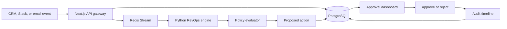

# CRM Revenue Ops Agent Workflow

Production-shaped RevOps agent for CRM pipeline automation, lead routing, approval workflows, and audit-safe next actions.

This repository demonstrates the operational control plane around AI-assisted revenue workflows. A Next.js gateway accepts CRM-style events, validates and persists them, queues work asynchronously, and a Python engine scores records, evaluates policy, proposes next actions, and writes audit events. External CRM and email integrations are intentionally mocked and deterministic.

## What this shows

- CRM event intake with validation and idempotency.
- Redis Streams-style async queue boundary with dead-letter and stale pending recovery concepts.
- Deterministic lead/opportunity scoring without paid API keys.
- Policy-gated actions where risky updates require approval.
- Human approval/rejection flow with audit events.
- RevOps dashboard shaped like an internal console, not a landing page.
- Local test and security checks with one root command.

## Architecture



## Runtime boundaries

- `apps/web`: Next.js dashboard and API route skeletons for event intake, proposal lookup, and approval decisions.
- `services/engine`: Python scoring, policy, and worker logic.
- `packages/shared`: JSON contracts for event and proposed-action payloads.
- `infra/db`: PostgreSQL schema and seed data.
- `tools`: local checks for repository shape, security hygiene, Docker Compose, and Python test execution.

## Quick start

```bash
npm run check
docker compose config --quiet
```

To run the web app after installing dependencies:

```bash
npm install
npm run dev
```

The local stack is declared in `docker-compose.yml`. The Compose config check does not require secrets.

Note: the web workspace pins `next@16.3.0-canary.49` because the current stable Next release depends on a PostCSS version flagged by `npm audit`. This can be moved back to a stable Next release once stable carries PostCSS `8.5.10` or newer.

## Example event

```bash
curl -X POST http://localhost:3000/api/crm/events \
  -H "Content-Type: application/json" \
  -d '{
    "source": "hubspot-demo",
    "externalRef": "lead_1001",
    "eventType": "lead.created",
    "occurredAt": "2026-06-12T09:30:00Z",
    "payload": {
      "accountName": "Northstar Analytics",
      "domain": "northstar.example",
      "segment": "b2b_saas",
      "employeeCount": 180,
      "seniority": "vp",
      "signals": ["pricing_page", "product_docs"],
      "consentStatus": "opted_in"
    }
  }'
```

The endpoint returns `202 Accepted` after validation and idempotency calculation. In this portfolio implementation the adapters are deterministic and safe by default.

## Policy examples

- Auto-safe: create an internal follow-up task for an owner.
- Requires approval: draft outbound email, move opportunity to commit, reassign owner, change forecast amount.
- Blocked: send external email, delete CRM record, overwrite closed-won/closed-lost, or update records without an idempotency key.

## Test commands

```bash
npm run lint
npm run test:node
npm run test:python
npm run security:scan
npm run audit:deps
npm run build
npm run compose:check
npm run check
```

## Security posture

- No real CRM credentials, API keys, email provider credentials, or customer data are committed.
- `.env.example` is safe to publish; `.env` and `.env.*` are ignored.
- External sends and destructive CRM changes are blocked in policy.
- Risky internal CRM changes require explicit approval.
- Audit events are written for event intake, proposal creation, and approval transitions.

## Trade-offs

This repo prioritizes credible architecture and local reviewability over third-party integrations. Salesforce, HubSpot, Slack, and email providers are represented by deterministic contracts and adapters so the repo can be published safely without secrets or external accounts.
